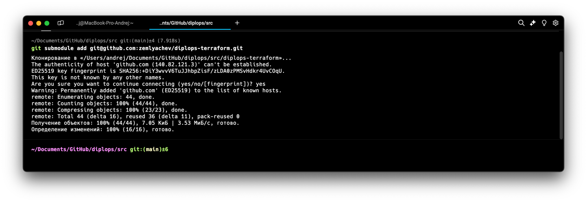
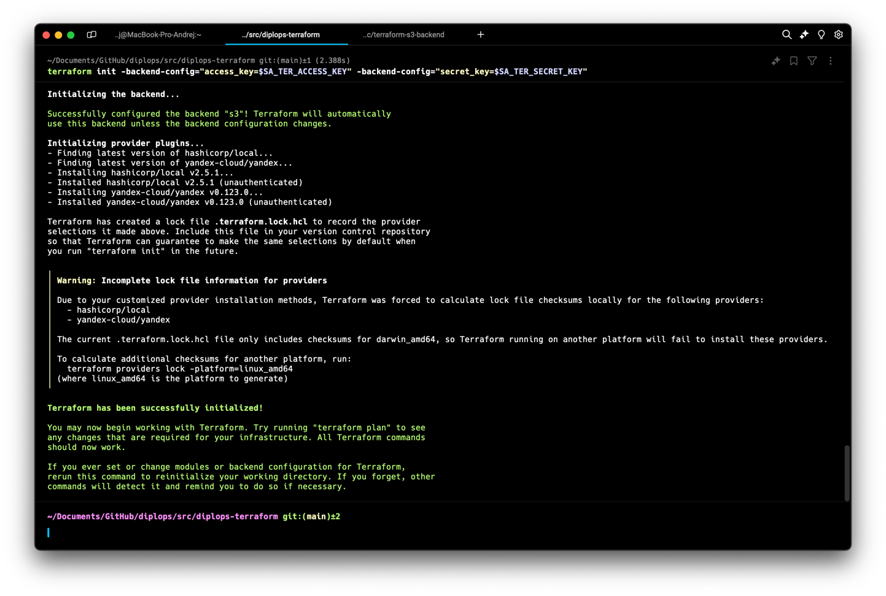
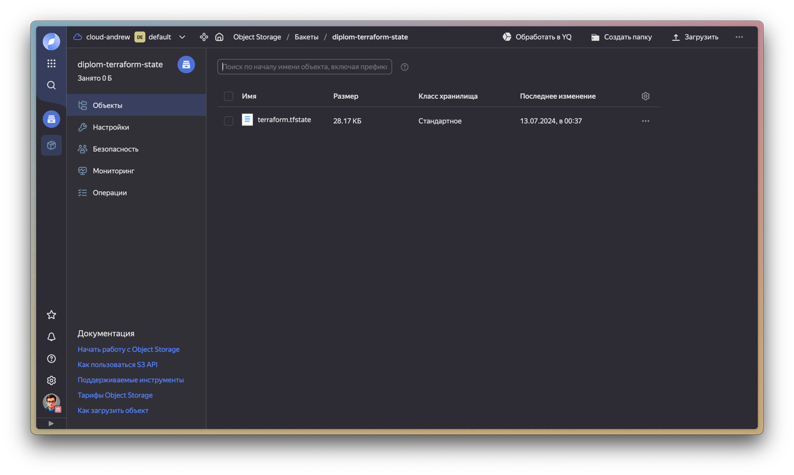
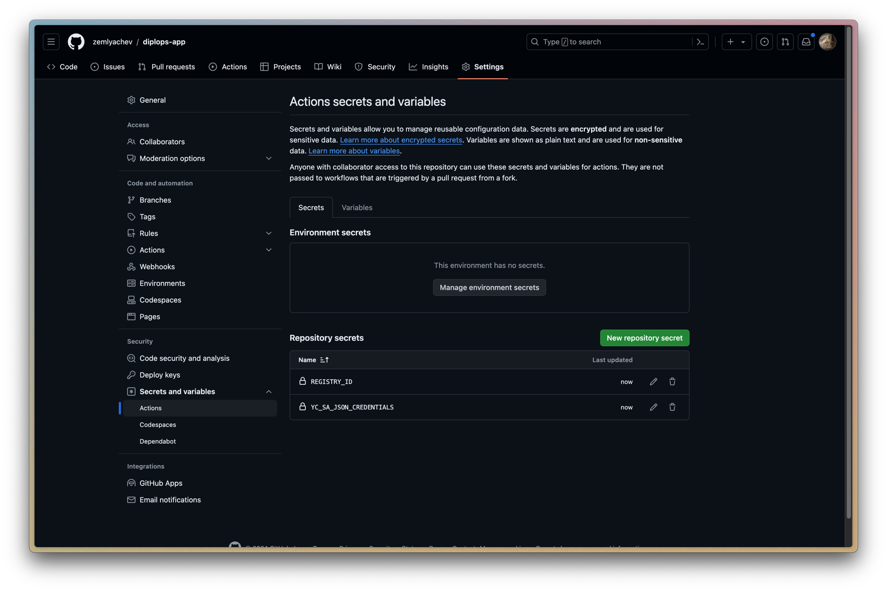
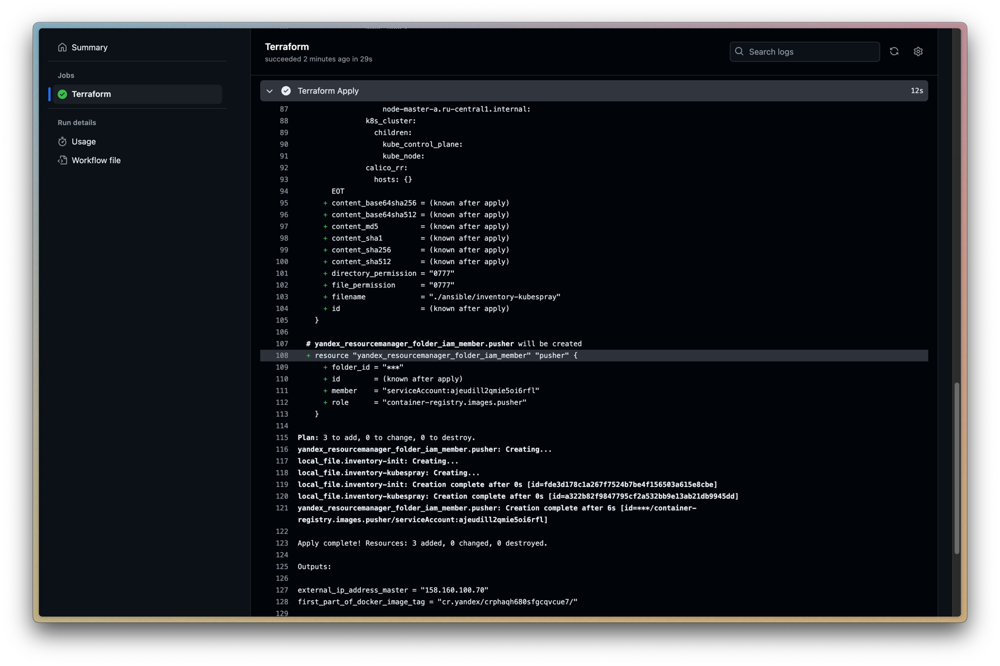
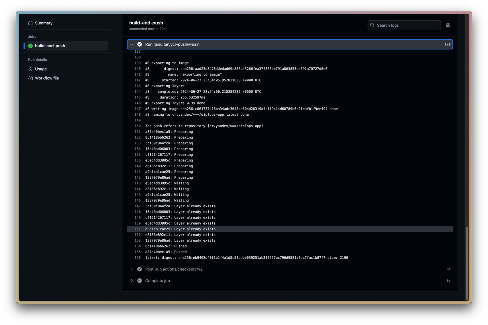
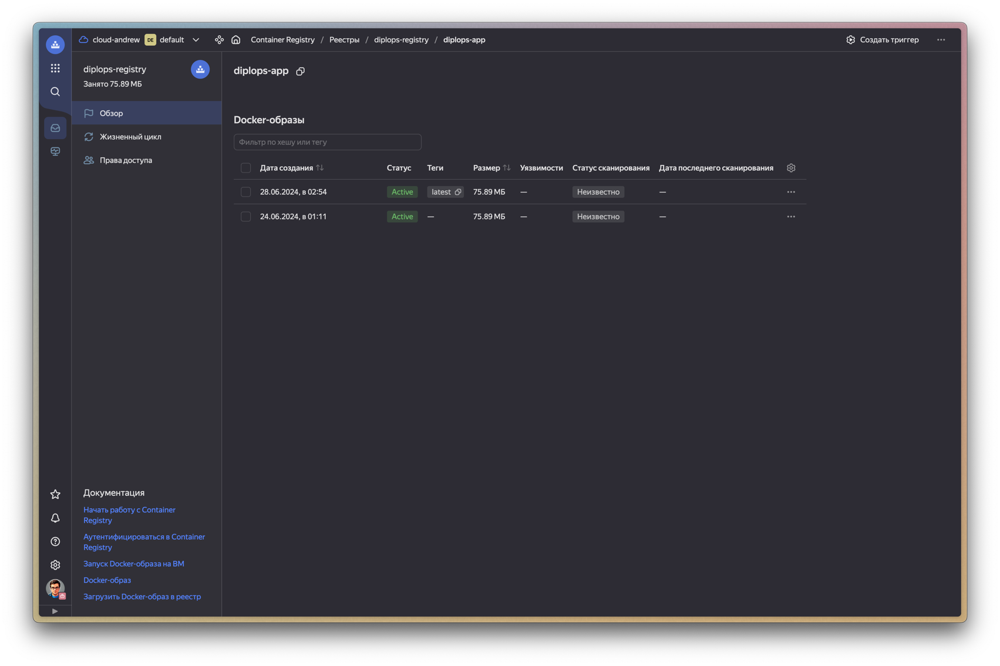
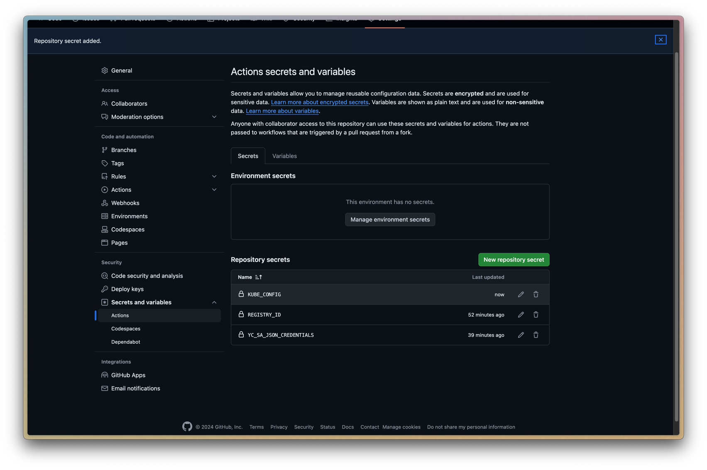
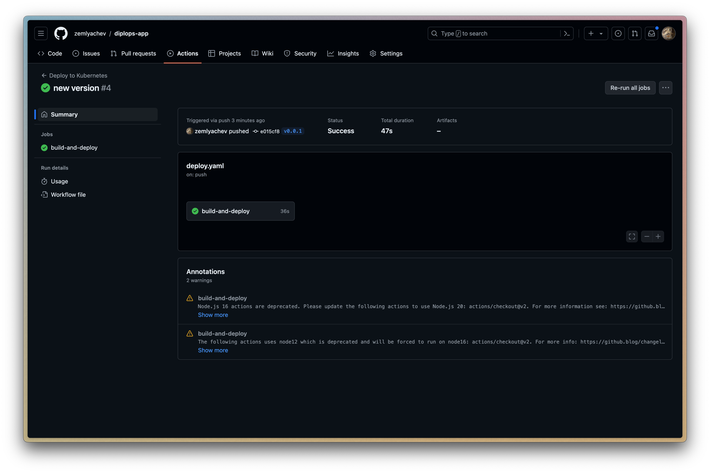
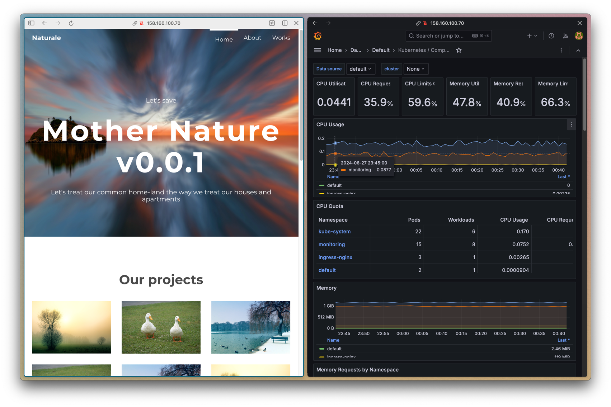

# Дипломный практикум в Yandex.Cloud
* [Дипломный практикум в Yandex.Cloud](#дипломный-практикум-в-yandexcloud)
    * [Цели:](#цели)
    * [Этапы выполнения:](#этапы-выполнения)
        * [Создание облачной инфраструктуры](#создание-облачной-инфраструктуры)
            * [Конфигурация и сервисный аккаунт](#конфигурация-и-сервисный-аккаунт)
            * [Backend Terraform](#backend-terraform)
            * [Создайте VPC с подсетями в разных зонах доступности](#создайте-vpc-с-подсетями-в-разных-зонах-доступности)
        * [Создание Kubernetes кластера](#создание-kubernetes-кластера)
            * [Подготавливаем виртуальные машины Compute Cloud для создания Kubernetes-кластера](#подготавливаем-виртуальные-машины-compute-cloud-для-создания-kubernetes-кластера)
            * [Деплой Kubernetes](#деплой-kubernetes)
        * [Создание тестового приложения](#создание-тестового-приложения)
            * [Пререквизиты](#пререквизиты)
            * [Образ](#образ)
            * [Yandex Container Registry, созданный также с помощью terraform](#yandex-container-registry-созданный-также-с-помощью-terraform)
            * [Деплой образа в реестр](#деплой-образа-в-реестр)
        * [Подготовка cистемы мониторинга и деплой приложения](#подготовка-cистемы-мониторинга-и-деплой-приложения)
            * [Мониторинг](#мониторинг)
            * [Деплой](#деплой)
            * [Автоматизация](#автоматизация)
        * [Установка и настройка CI/CD](#установка-и-настройка-cicd)
            * [Сборка и загрузка в реестр по коммиту в main](#сборка-и-загрузка-в-реестр-по-коммиту-в-main)
            * [Сборка и деплой при создании тега](#сборка-и-деплой-при-создании-тега)
          
**Перед началом работы над дипломным заданием изучите [Инструкция по экономии облачных ресурсов](https://github.com/netology-code/devops-materials/blob/master/cloudwork.MD).**

---
## Цели:

1. Подготовить облачную инфраструктуру на базе облачного провайдера Яндекс.Облако.
2. Запустить и сконфигурировать Kubernetes кластер.
3. Установить и настроить систему мониторинга.
4. Настроить и автоматизировать сборку тестового приложения с использованием Docker-контейнеров.
5. Настроить CI для автоматической сборки и тестирования.
6. Настроить CD для автоматического развёртывания приложения.

---
## Этапы выполнения:

### Создание облачной инфраструктуры

Предварительная подготовка к установке и запуску Kubernetes кластера.

#### Конфигурация и сервисный аккаунт

1. Установим новую версию терраформа `brew install hashicorp/tap/terraform` так как `brew install terraform` - deprecated версия 1.5.7
2. Настроим доступ согласно [официальной инструкции](https://yandex.cloud/ru/docs/tutorials/infrastructure-management/terraform-quickstart#configure-terraform) 
3. Добавим аутентификационные данные в переменные окружения:
    ```bash
    export TF_VAR_YC_TOKEN=$(yc iam create-token)
    export TF_VAR_YC_CLOUD_ID=$(yc config get cloud-id)
    export TF_VAR_YC_FOLDER_ID=$(yc config get folder-id)
    export TF_VAR_YC_ZONE=$(yc config get compute-default-zone)
    ```
    > Если команда `yc config get compute-default-zone` ничего не отдает, то необходимо выполнить `yc config set compute-default-zone "ru-central1-a"`
4. Создадим файл `provider.tf` для Terraform с информацией об облачном провайдере: 
    ```hcl
    terraform {
      required_providers {
        yandex = {
          source = "yandex-cloud/yandex"
        }
      }
      required_version = ">= 0.13"
    }
    
    provider "yandex" {
      token     = var.YC_TOKEN
      cloud_id  = var.YC_CLOUD_ID
      folder_id = var.YC_FOLDER_ID
      zone      = var.YC_ZONE
    }
    ```
5. Добавим описание основных переменных для провайдера из переменных окружения в файл `variables.tf`
    ```hcl
    variable "YC_TOKEN" { type = string }
    variable "YC_FOLDER_ID" { type = string }
    variable "YC_CLOUD_ID" { type = string }
    variable "YC_ZONE" { type = string }
    ```
6. Создадим файлик `sa-main-editor.tf` сервисным аккаунтом `sa-ter-diplom` с ролью `editor`:
    ```hcl
    resource "yandex_iam_service_account" "sa-ter-diplom" {
      folder_id = var.YC_FOLDER_ID
      name      = "sa-ter-diplom"
    }
    resource "yandex_resourcemanager_folder_iam_member" "editor" {
      folder_id = var.YC_FOLDER_ID
      role      = "editor"
      member    = "serviceAccount:${yandex_iam_service_account.sa-ter-diplom.id}"
    }
    ```

#### Backend Terraform 

1. Подготовим bucket для backend в отдельном манифесте в директории [terraform-s3-backend](src%2Fterraform-s3-backend) с аналогичными основному манифесту параметра для доступа к облачному провайдеру
    ```hcl
    # Backend bucket access key
    resource "yandex_iam_service_account_static_access_key" "accesskey-bucket" {
      service_account_id = yandex_iam_service_account.sa-ter-diplom.id
    }
    
    # Backend bucket
    resource "yandex_storage_bucket" "diplom-terraform-state" {
      access_key            = yandex_iam_service_account_static_access_key.accesskey-bucket.access_key
      secret_key            = yandex_iam_service_account_static_access_key.accesskey-bucket.secret_key
      bucket                = "diplom-terraform-state"
      default_storage_class = "STANDARD"
      acl                   = "public-read"
      force_destroy         = "true"
      depends_on            = [yandex_iam_service_account_static_access_key.accesskey-bucket]
      anonymous_access_flags {
        read        = true
        list        = true
        config_read = true
      }
    }
    ```

2. Выполним `terraform init`:
    

3. Проверим `terraform validate`:
    

4. Выполним `terraform plan` и `terraform apply`:
    
    

5. Получим ключи доступа для сервисного аккаунта
    ```bash
    yc iam service-account list
    yc iam access-key create --service-account-name sa-ter-diplom
    ```
    
6. Прихраним ключи в переменных окружения
    ```bash
    export SA_TER_ACCESS_KEY="<идентификатор_ключа>"
    export SA_TER_SECRET_KEY="<секретный_ключ>"
    ```
    

#### Основной манифест

1. Для хранения основного проекта terraform будем использовать отдельный репозиторий в GitHub, который будем использовать в качества git submodule
2. Создадим новый репозиторий [diplops-terraform](https://github.com/zemlyachev/diplops-terraform)
3. Подключим из папки src как submodule
     
3. Перенесем манифест созданный ранее
4. Добавим описание бекенда в [provider.tf](src%2Fdiplops-terraform%2Fprovider.tf)
    ```hcl
    terraform {
      ...  
      backend "s3" {
        endpoints = {
          s3 = "https://storage.yandexcloud.net"
        }
        bucket = "diplom-terraform-state"
        region = "ru-central1-a"
        key    = "terraform.tfstate"
    
        skip_region_validation      = true
        skip_credentials_validation = true
        skip_requesting_account_id  = true # Необходимая опция Terraform для версии 1.6.1 и старше.
        skip_s3_checksum            = true # Необходимая опция при описании бэкенда для Terraform версии 1.6.3 и старше.
      }
    }
    ```
5. Для переноса состояния выполним `terraform init -backend-config="access_key=$SA_TER_ACCESS_KEY" -backend-config="secret_key=$SA_TER_SECRET_KEY"

    
    

#### Создайте VPC с подсетями в разных зонах доступности

1. Для начала опишем [variables.tf](src%2Fdiplops-terraform%2Fvariables.tf):
    ```hcl
    variable "subnets" {
      type    = map(string)
      default = ({
        a = "192.168.10.0/24",
        b = "192.168.20.0/24",
        d = "192.168.30.0/24"
      })
    }
    ```
2. Опишем в [vpc.tf](src%2Fdiplops-terraform%2Fvpc.tf) VPC и подсети и nat gateway, чтобы у воркеров не было внешний ip-адресов
3. Применим
    
    
4. Terraform сконфигурирован и создание инфраструктуры посредством Terraform возможно без дополнительных ручных действий.

### Создание Kubernetes кластера

#### Подготавливаем виртуальные машины Compute Cloud для создания Kubernetes-кластера

1. Добавим в файлы:
    * [locals.tf](src%2Fdiplops-terraform%2Flocals.tf):
        ```hcl
        # Публичный ключик ssh
        locals {
          ssh_public_key = file("id_rsa.pub")
          ubuntu_ssh_key = "ubuntu:${local.ssh_public_key}"
        }
        ```
    * [variables.tf](src%2Fdiplops-terraform%2Fvariables.tf):
        ```hcl
        # Подходящий образ для виртуалки
        variable "ubuntu_image_id" {
          type        = string
          default     = "fd88bokmvjups3o0uqes"
          description = "ubuntu-22-04-lts-v20240603"
        }
      
        # Воркеры <ключ подсети> = <количество виртуалок>
        variable "workers" {
          type    = map(number)
          default = ({
            a = 1,
            b = 1,
            d = 1
          })
        }
        ```
    * [k8s-master.tf](src%2Fdiplops-terraform%2Fk8s-master.tf):
        ```hcl
        # VM kube master node
        resource "yandex_compute_instance" "node-master" {
          name                      = "node-master-a"
          hostname                  = "node-master-a"
          zone                      = "ru-central1-a"
          platform_id               = "standard-v3"
          allow_stopping_for_update = true
          resources {
            cores         = 2
            memory        = 4
            core_fraction = 50
          }
          boot_disk {
            initialize_params {
              image_id = var.ubuntu_image_id
              size     = 10
            }
          }
          network_interface {
            subnet_id = yandex_vpc_subnet.subnet["a"].id
            nat       = true
          }
          metadata = {
            serial-port-enable = 1
            ssh-keys           = local.ubuntu_ssh_key
          }
        }
        
        output "external_ip_address_master" {
          value = yandex_compute_instance.node-master.network_interface.0.nat_ip_address
        }
        ```
    * [k8s-worker.tf](src%2Fdiplops-terraform%2Fk8s-worker.tf):
        ```hcl
        # VM Worker Nodes
        resource "yandex_compute_instance" "node-worker" {
          for_each = merge([
            for k, v in var.workers :
            {for i in range(v) : "node-worker-${k}-${i + 1}" => k}
          ]...)
          name                      = each.key
          zone                      = "ru-central1-${each.value}"
          hostname                  = each.key
          platform_id               = "standard-v3"
          allow_stopping_for_update = true
          resources {
            cores         = 2
            memory        = 2
            core_fraction = 20
          }
          boot_disk {
            initialize_params {
              image_id = var.ubuntu_image_id
              size     = 10
            }
          }
          scheduling_policy {
            preemptible = true # приостанавливаемая
          }
          network_interface {
            subnet_id = "${yandex_vpc_subnet.subnet[each.value].id}"
            nat       = false
          }
          metadata = {
            serial-port-enable = 1
            ssh-keys           = local.ubuntu_ssh_key
          }
        }
        ```
2. Для конфигурации Kubespray создадим манифесты с помощью terraform в файле [kubespray-inventory.tf](src%2Fdiplops-terraform%2Fkubespray-inventory.tf)
3. Применим
    
    > В процессе внешний ip-адрес мастер ноды будет меняться...

    
4. На выходе получили 2 файла
    * [inventory-init](src%2Fdiplops-terraform%2Fansible%2Finventory-init)
    * [inventory-kubespray](src%2Fdiplops-terraform%2Fansible%2Finventory-kubespray)

#### Деплой Kubernetes

1. Выполним подготовку `ansible-playbook -i ../diplops-terraform/ansible/inventory-init -b -v -u ubuntu init.yaml`
   

2. Подключаемся к мастер ноде, которая будет control plane, и запускаем плейбук kubespray
    ```bash
    cd kubespray/
    sudo ansible-playbook -i inventory/diplom-cluster/inventory-kubespray -u ubuntu -b -v --private-key=/home/ubuntu/.ssh/id_rsa cluster.yml
    ```
   
3. Настроим kubectl на стороне мастер ноды с помощью плейбука [prepare-config.yaml](src%2Fansible%2Fprepare-config.yaml)
    ```bash
    ansible-playbook -i ../diplops-terraform/ansible/inventory-init -b -v -u ubuntu prepare-config.yaml
    ```
4. Развернутый кластер
    
    

5. Заберем конфиг на локальную машину для удобства с помощью плейбука [get-config.yaml](src%2Fansible%2Fget-config.yaml)
    ```bash
    ansible-playbook -i ../diplops-terraform/ansible/inventory-init -v -u ubuntu get-config.yaml
    ```
    Теперь управление кластером доступно локально

### Создание тестового приложения

#### Пререквизиты
* установлен docker


#### Образ

1. Создадим отдельный публичный репозиторий https://github.com/zemlyachev/diplops-app
2. Возьмем для примера любой шаблон
3. Напишем простейший Dokerfile
4. Проверим сборку и запуск локально
    
5. Поправим пару моментов в шаблоне
6. Проверим работоспособность образа
    
7. Локально работает
    

#### Yandex Container Registry, созданный также с помощью terraform

1. Создадим файл [registry.tf](src%2Fdiplops-terraform%2Fregistry.tf) с директивой для хранилища образов, а также сервис аккаунтом для обращение к registry из GitHub Actions
2. Применим
    

#### Деплой образа в реестр

1. Образы необходимо создавать с тегом, или добавить тек в последствии для деплоя его в реестр
2. Добавим тег к ранее собранному образу
    
3. Настроем докер на YCR
    
4. Запушим в реестр
    
    

### Подготовка cистемы мониторинга и деплой приложения

#### Мониторинг

1. Клонируем репозиторий 
    `git clone https://github.com/prometheus-operator/kube-prometheus`
    
    
    
2. Выполняем
    ```bash
    cd kube-prometheus
    kubectl apply --server-side -f manifests/setup
    kubectl wait \
        --for condition=Established \
        --all CustomResourceDefinition \
        --namespace=monitoring
    kubectl apply -f manifests/
    ```
    
    
    

3. Ждем когда все поднимется
    

4. Для подключения к grafana из вне, поменяем тип сервиса на NodePort и допишем номер порта, например 31001
    `kubectl edit svc stable-grafana -n monitoring`
    
5. Зайдем на http://158.160.100.70:31001, авторизуемся с помощью стандартного логина и пароля (admin/admin, получим предложение поменять пароль, поменяем на что-то)
    

#### Деплой

1. Создадим манифест для ранее созданного приложения [app-dp-svc.yaml](https://github.com/zemlyachev/diplops-app/blob/main/app-dp-svc.yaml)
2. Для доступа к реестру создадим сервисный аккаунт [kuber-registry-sa.tf](src/terraform/kuber-registry-sa.tf)
    
3. Создадим ключ
    
4. Авторизуемся этим ключем
    
5. Создадим секрет для добавления его в Deployment
    
6. Выполним манифест `kubectl apply -f app-dp-svc.yaml`
    
    На http://158.160.100.70:30080 появился наш сайт

#### Автоматизация

1. В ранее созданный репозиторий [diplops-terraform](https://github.com/zemlyachev/diplops-terraform) добавим секреты для доступа к Yandex.Cloud и хранилищу состояния
   
4. Напишем pipeline для GitHub Actions [terraform-ci-cd.yml](https://github.com/zemlyachev/diplops-terraform/blob/main/.github/workflows/terraform-ci-cd.yml)
5. Пушим в main и видим что сборка прошла успешно (почти с первого раза)
   
6. По результатам в бакете должны увидеть инвентори для ansible
   

### Установка и настройка CI/CD

#### Сборка и загрузка в реестр по коммиту в main

1. Для репозитория https://github.com/zemlyachev/diplops-app пропишем также pipeline github actions
2. Добавляем секреты
    
3. Создаем pipline [build.yaml](https://github.com/zemlyachev/diplops-app/blob/main/.github/workflows/build.yml)
4. Не забудем добавить роль "container-registry.images.pusher" в https://github.com/zemlyachev/diplops-terraform/blob/main/kuber-registry-sa.tf
    Сработал github action:
    
5. Коммитим изменения, проверям action
    
6. Смотрим в реестре, обновился новый образ с тегом latest
    

#### Сборка и деплой при создании тега

1. Создаем pipeline [deploy.yaml](https://github.com/zemlyachev/diplops-app/blob/main/.github/workflows/deploy.yml)
2. Добавим секрет `KUBE_CONFIG` из `~/.kube/config` (`cat ~/.kube/config | base64`)
    
3. Изменим в шаблоне титульник и запушим с тегом `v0.0.1`
4. Видим что action отработал
    
5. Посмотрим на сам сайт, он обновился
    
6. CI/CD настроен


